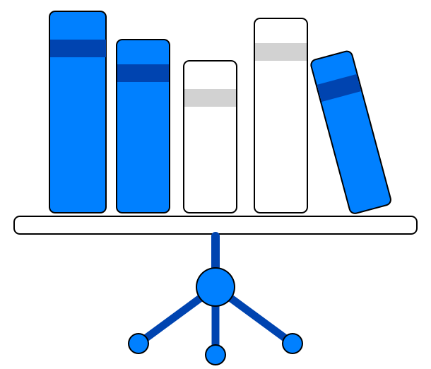
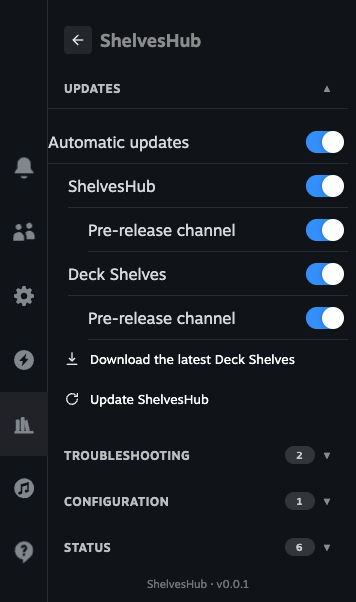
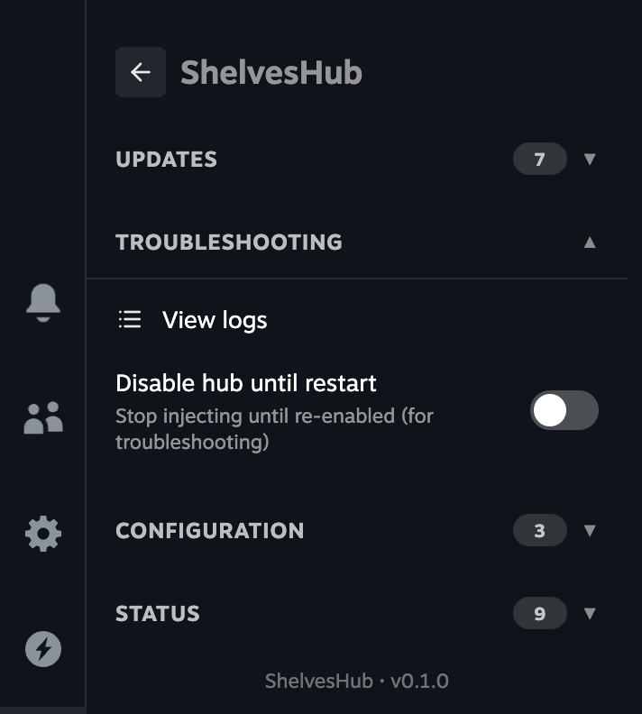
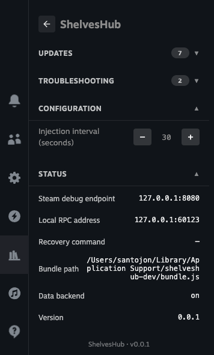
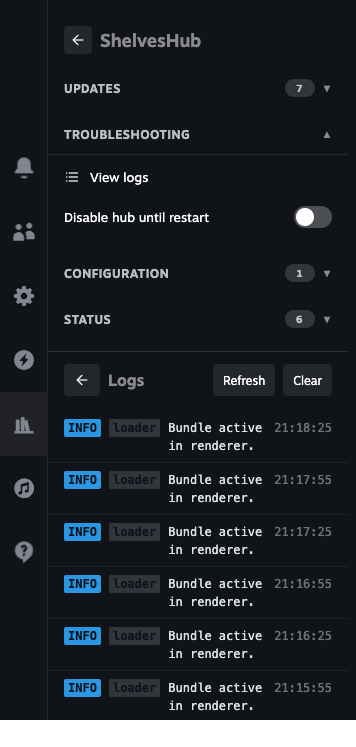

# ShelvesHub

*[Leia em português](docs/pt-BR/README.md)*

<div align="center">
<p>
  
</p>

[](https://github.com/santojon/ShelvesHub/actions/workflows/ci.yml)
[](https://github.com/santojon/ShelvesHub/actions/workflows/release.yml)
[](src/)
[](Cargo.toml)
[](https://github.com/ValveSoftware/SteamOS)
[](https://github.com/santojon/ShelvesHub/releases/latest)
[](https://github.com/santojon/ShelvesHub/releases/latest)
[](https://github.com/santojon/Deck-Shelves)
[](https://github.com/santojon/ShelvesHub/network/members)
[](https://github.com/santojon/ShelvesHub/graphs/traffic)
[](LICENSE)

</div>

ShelvesHub is the independent host service for [Deck Shelves](https://github.com/santojon/Deck-Shelves). It injects the Deck Shelves bundle into the Steam Big Picture UI and provides the runtime API the bundle calls into — no plugin loader required.

**Primary target:** SteamOS / Steam Deck. Also supported: Linux, macOS (Intel and Apple Silicon — the download is a universal binary), Windows.

## Contents

- [ShelvesHub](#shelveshub)
  - [Contents](#contents)
  - [How it works](#how-it-works)
  - [Features](#features)
  - [What it looks like](#what-it-looks-like)
  - [Documentation](#documentation)
  - [Installation](#installation)
    - [SteamOS / Steam Deck (one-click)](#steamos--steam-deck-one-click)
    - [Linux (one-click or from package)](#linux-one-click-or-from-package)
    - [macOS](#macos)
    - [Windows](#windows)
  - [Uninstalling](#uninstalling)
  - [Repository layout](#repository-layout)
  - [Releases](#releases)
  - [Contributing](#contributing)
  - [Security](#security)
  - [License](#license)

---

## How it works

The loader runs as a background service, watches for the Steam renderer, injects the Deck Shelves bundle (`bundle/index.js`) over the Chrome DevTools Protocol, and exposes a local HTTP JSON-RPC server (`127.0.0.1:60123`) the bundle uses to communicate with the host. If no bundle is present, the service obtains one first — reusing a local copy, copying it from an installed plugin loader, or downloading the newest release (`SHELVES_PRERELEASE=1` opts into pre-release versions). It can also host the Deck Shelves data backend itself, so a standalone install has the full online features (wishlist, prices, launchers) and not just local shelves. See [docs/debugging.md](docs/debugging.md) for the `shelves-devtools` CDP tool and the local/on-Deck debug workflow.

The shared `HostApi` contract (`@deck-shelves/host`, vendored as the `host/` submodule) defines what the host provides to the bundle, so one Deck Shelves build runs under this host or under a plugin loader unchanged. The Rust process (`src/`) implements the service side and the injected runtime (`runtime/shelves-host.js`) implements the in-renderer side.

It gives Deck Shelves its own tab in the Steam Quick Access Menu (on by default), opening the editor directly with the plugin's icon and header; if the bundle can't load, that tab shows a recovery panel instead of an empty tab. Where another host such as a plugin loader is installed too, the two coexist: exactly one Deck Shelves tab is shown (this host's), both hosts' tabs stay usable and edit the same settings, the plugin's wide side panel opens from whichever tab is on screen, and only one host writes settings at a time.

The service also **keeps itself and the bundle current**: with automatic updates on it downloads a newer Deck Shelves release and swaps it in place, and it can **update its own binary** from the latest ShelvesHub release. Update channels, a disable-until-restart switch, an editable safe subset of the configuration, and a merged host/runtime log viewer are all reachable from the tab, localized into 19 languages.

---

## Features

- **No plugin loader required** — hosts Deck Shelves by itself by injecting its bundle into the Steam Big Picture UI over the Chrome DevTools Protocol.
- **Coexists with another host** — if a plugin loader is also installed, the two run side by side: exactly one Deck Shelves tab shows, both hosts' tabs edit the same settings, and only one writes settings at a time.
- **Cross-platform** — SteamOS and the Steam Deck are the primary target; also Linux, macOS and Windows, each with a one-click installer and a plain script.
- **Linux ARM64** — native `aarch64` packages for SteamOS and Linux, with an architecture-aware installer and self-update (it verifies the binary's ELF machine type, so it never crosses architectures); the same download link resolves to the right build per device. Steam Frame validation on real hardware is in progress.
- **Universal macOS binary** — the macOS download runs natively on both Apple Silicon and Intel Macs; CI verifies the shipped binary is universal.
- **Native Quick Access tab** — opens the Deck Shelves editor directly, with real Steam buttons and toggles, a gamepad focus ring and a theme-tinted icon; a recovery panel shows instead if the bundle can't load.
- **Brings its own copy of Deck Shelves** — reuses a local copy, copies one from an installed loader, or downloads the newest release (`SHELVES_PRERELEASE=1` opts into pre-releases).
- **Hosts the data backend** — supervises the Deck Shelves data backend over stdio, restarts it on crashes and surfaces its logs, so wishlist, prices, backups and friends work on a standalone install.
- **Updates itself** — downloads and verifies a newer ShelvesHub, swaps its own binary in place, and restarts the service to finish (or asks you to restart when it can't).
- **Keeps Deck Shelves current** — with automatic updates on, checks periodically and installs a newer release in place, then reloads, so the "update available" prompt clears on its own.
- **Update channels** — stable and pre-release are separate for the host and for Deck Shelves; each finer switch only appears once the one above it is on.
- **Optional boot animation** — installs a short startup animation into Steam's own startup-movie slot, with a Deck-native 1280×800 cut and a 1080p desktop cut chosen per platform; a live toggle, removed when turned off.
- **Resilient by design** — a windows-collapse health gate never force-restarts Steam; it pauses and, on a confirmed black screen, runs a per-platform recovery (restart the Deck's Gaming Mode session, or bring Steam back into Big Picture on desktop).
- **Version-skew safe settings** — the host's own settings store preserves keys it doesn't recognise, so running mixed versions across machines never silently drops a setting.
- **Gamepad UI aware** — by default it hosts only while the gamepad / Big Picture UI is on screen; an experimental toggle (macOS / Windows) also injects into the plain desktop client.
- **Restart to apply, in one click** — changing a setting that needs a restart surfaces a button that restarts the host and Steam together so the change takes effect.
- **Editable safe configuration** — a curated subset of the operational config is editable in the tab, with a read-only status readout of the effective values.
- **Merged log viewer** — host + runtime in one gamepad-navigable, colour-coded stream, newest first, with a refresh control; B takes you back.
- **Disable until restart** — a troubleshooting switch stands the host down until the next service restart without uninstalling anything.
- **One shared contract** — the `@deck-shelves/host` API defines what the host provides, so one Deck Shelves build runs under this host or under a plugin loader unchanged.
- **Localized** — the host tab is translated into 19 languages.
- **No-device verification** — a Docker simulation harness runs the runtime, a daemon → headless-Chromium injection smoke, the install / uninstall lifecycle, and the Deck Shelves cross-OS backend probes under the host in a container (on Linux x86_64 and ARM64 via emulation).

---

## What it looks like

ShelvesHub adds its own management panel to the Steam Quick Access menu — the part that makes it more than a loader. Captured live from a Steam Big Picture session:

<div align="center">
<table>
<tr>
<td align="center" width="50%"><br><sub><b>Automatic updates</b> — host + Deck Shelves, each with a pre-release channel</sub></td>
<td align="center" width="50%"><br><sub><b>Troubleshooting</b> — view logs, or disable the host until restart</sub></td>
</tr>
<tr>
<td align="center" width="50%"><br><sub><b>Configuration + Status</b> — an editable safe subset, and a read-only readout</sub></td>
<td align="center" width="50%"><br><sub><b>Log viewer</b> — the host and runtime logs in one stream</sub></td>
</tr>
</table>
</div>

---

## Documentation

- [Architecture](docs/architecture.md) — how the daemon, injected runtime, and RPC server fit together.
- [HostApi contract](docs/host-api.md) — the `window.__SHELVES_HOST__` surface the bundle consumes.
- [Backend contract](docs/backend-contract.md) — hosting the Deck Shelves data backend over stdio.
- [Usage](docs/usage.md) — running and configuring the service.
- [Development](docs/development.md) — building and working on ShelvesHub.
- [Debugging & DevTools](docs/debugging.md) — the `shelves-devtools` CDP tool and the debug workflow.
- [Troubleshooting](docs/troubleshooting.md) — port conflicts, coexistence, and recovery.
- [Showcase & screenshots](docs/showcase.md) — the screenshot set and how it is published.

---

## Installation

### SteamOS / Steam Deck (one-click)

Download `shelveshub.desktop` from the [latest release](https://github.com/santojon/ShelvesHub/releases/latest), open it in Desktop Mode, and follow the terminal prompt. Installs to `~/.local/share/shelveshub` with a user-level systemd service — no sudo required.

### Linux (one-click or from package)

One-click: download `shelveshub-linux.desktop` from the [latest release](https://github.com/santojon/ShelvesHub/releases/latest), open it, and follow the terminal prompt (it downloads and installs, prompting for sudo).

From the package instead: download `shelveshub-linux.tar.gz`, extract, and run:

```bash
sudo bash installer/install.sh
```

Manages a system-level `shelveshub.service` via systemd.

### macOS

Download **`Install ShelvesHub.app`** (a clickable installer app carrying the ShelvesHub icon) from the latest release and double-click it. On first run, right-click → Open to bypass Gatekeeper. A plain `install-mac.command` script is also published. The macOS build is a **universal binary**, so it runs natively on both Apple Silicon and Intel Macs.

### Windows

Download **`shelveshub-setup.exe`** (a setup program carrying the ShelvesHub icon) from the latest release and run it, accepting the UAC prompt. A plain `install-windows.bat` script is also published.

---

## Uninstalling

Each uninstaller stops and removes the background service and the install directory. Your Deck Shelves settings (shared with other hosts) are kept unless you pass `--purge`. A **one-click uninstaller** is published for each platform alongside the installer (double-click, like installing) — or use the commands below.

| Platform | One-click | Or by hand |
|---|---|---|
| SteamOS / Steam Deck | `uninstall-shelveshub.desktop` | `bash ~/.local/share/shelveshub/uninstall.sh` (installed copy), or `bash uninstall.sh` from the extracted package |
| Linux | `uninstall-shelveshub-linux.desktop` | `sudo bash /opt/shelveshub/uninstall.sh` (or `sudo bash uninstall.sh` from the package) |
| macOS | `uninstall-mac.command` | `bash ~/.local/share/shelveshub/uninstall_mac.sh` — add `--purge` to also remove settings and Steam's CEF debug flag |
| Windows | `uninstall-windows.bat`, or **Settings → Apps** | run `uninstall.exe` in the install folder, or `installer\uninstall.ps1` from the package |

`--purge` (macOS/SteamOS) additionally removes the shared Deck Shelves settings and the `.cef-enable-remote-debugging` flag; restart Steam afterward so it stops exposing the debug port.

---

## Repository layout

```
src/
  main.rs                   Entry point — spawns RPC thread, starts injection loop
  loader/                   Injection loop + preload (document-start) mode
  cdp/                      Chrome DevTools Protocol client
  rpc.rs                    TCP JSON-RPC server (127.0.0.1:60123)
  populate.rs               Obtains the bundle & backend; applies plugin and hub self-updates
  backend.rs                Supervises the hosted data backend
  store.rs                  The host's own settings, atomically persisted
  logger.rs config.rs state.rs
runtime/
  shelves-host.js           The injected host runtime (installs the HostApi + native tab)
  i18n/                     Per-locale strings, inlined at injection time
  backend/                  Optional data-backend runner
installer/
  SteamOS/                  One-click .desktop + user systemd service
  Linux/                    System-wide install.sh + systemd service
  macOS/                    install_mac.sh + launchd plist + one-click .command + .app
  Windows/                  install.ps1 + one-click .bat + NSIS setup + registry file
assets/
  icon.svg tab-icon.svg     App icon + tintable tab icon
  icons/                    Generated rasters (.ico / .icns / PNGs) for the installers
shelveshub.config.json      Optional settings (RPC/CEF ports, coexistence, recovery)
bundle/
  index.js                  Placeholder — replaced by the Deck Shelves release bundle
docs/
  architecture.md           System design and component overview
  host-api.md               HostApi contract reference
  development.md            SSH development workflow
  usage.md                  Platform-specific usage notes
  debugging.md              shelves-devtools + local/on-Deck debug workflow
  troubleshooting.md        Ports, coexistence and recovery — fixes via the config file
docker/
  Dockerfile entrypoint.sh  Linux simulation harness — runs the runtime, a
                            daemon→headless-Chromium injection smoke, and the
                            install/uninstall lifecycle in a container (no device)
```

Settings live in `shelveshub.config.json` next to the binary (env var > file >
default). See [docs/troubleshooting.md](docs/troubleshooting.md) for port conflicts,
coexistence with another host, and black-screen recovery.

---

## Releases

Each release publishes the per-platform packages, one-click scripts, and clickable installers:

| File | Description |
|---|---|
| `shelveshub-steamos.tar.gz` | SteamOS package, x86_64 (binary + installer + bundle slot) |
| `shelveshub-steamos-aarch64.tar.gz` | SteamOS package, ARM64 |
| `shelveshub-linux.tar.gz` | Linux package, x86_64 |
| `shelveshub-linux-aarch64.tar.gz` | Linux package, ARM64 |
| `shelveshub-macos.tar.gz` | macOS package (universal binary — Apple Silicon and Intel) |
| `shelveshub-windows.zip` | Windows package |
| `shelveshub.desktop` | SteamOS one-click installer — detects x86_64 vs. ARM64 at install time and fetches the matching package |
| `shelveshub-linux.desktop` | Linux one-click installer — same architecture auto-detection |
| `install-mac.command` | macOS one-click script |
| `install-windows.bat` | Windows one-click script |
| `Install ShelvesHub.app` (zipped) | macOS clickable installer app (with icon) |
| `shelveshub-setup.exe` | Windows setup program (with icon) |

---

## Contributing

See [CONTRIBUTING.md](CONTRIBUTING.md) for the development workflow and [CODE_OF_CONDUCT.md](CODE_OF_CONDUCT.md) for community expectations.

## Security

Report vulnerabilities via [SECURITY.md](SECURITY.md).

## License

This project is released under the terms in the [LICENSE](LICENSE) file.
