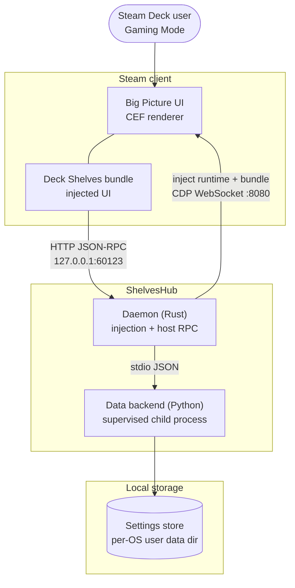
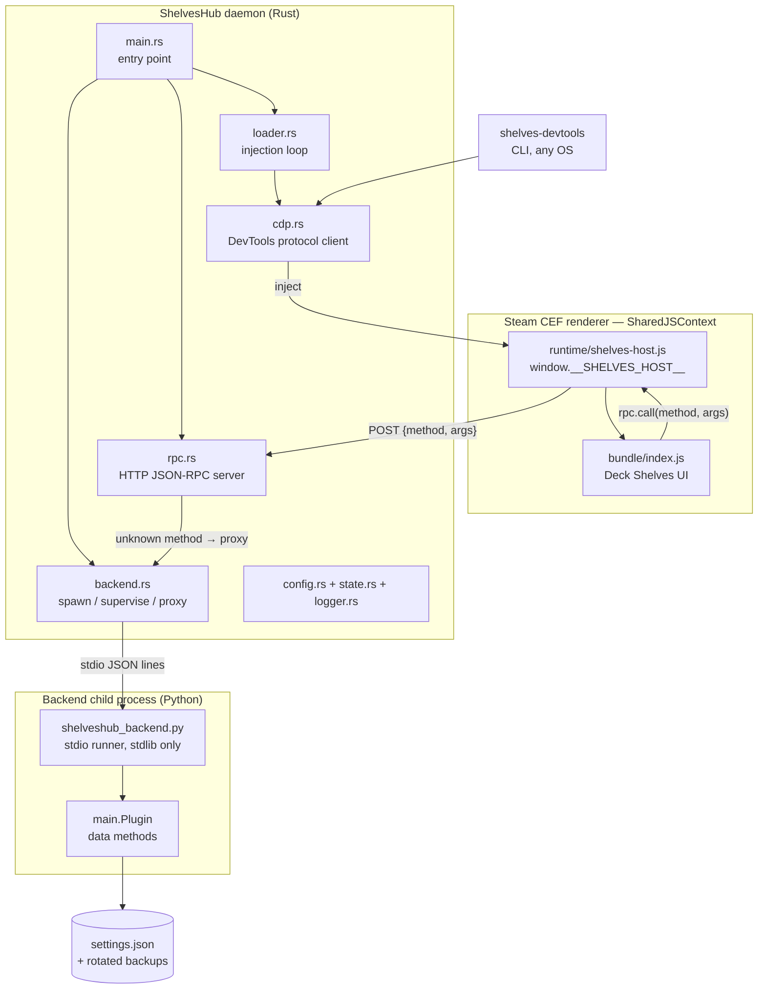
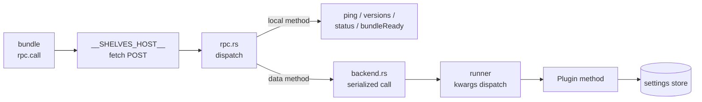

# ShelvesHub — Architecture

ShelvesHub is a small cross-platform service that injects the Deck Shelves
bundle into the Steam Big Picture UI. It provides the runtime host APIs the
bundle calls into, and manages the injection lifecycle across Linux/SteamOS,
macOS, and Windows.

---

## System overview

### The service in its environment

### Runtime pieces

### Data request path

The bundle receives the `HostApi` object as `window.__SHELVES_HOST__` at
startup. It uses that object to register mount/unmount hooks, invoke host
methods, and manage routes. UI components and all rendering logic live entirely
inside the bundle. Data methods flow through one serialized pipeline — a single
in-flight backend call at a time — so writes never race inside this host.

---

## Components

### Loader (`src/loader.rs`)

Every tick (default 30s) it connects to the Steam CEF renderer over the Chrome
DevTools Protocol, probes whether the bundle is already running
(`window.__SHELVES_LOADER__`), and — if not — injects the host runtime
(`runtime/shelves-host.js`, which becomes `window.__SHELVES_HOST__`) followed by
`bundle/index.js` via `Runtime.evaluate`. The connection is rebuilt each tick,
so a Steam restart is re-injected automatically. Paths and the CEF endpoint are
configurable (`src/config.rs`).

Before injecting, the loop honours the renderer's single-owner claim
(`window.__DECK_SHELVES_OWNER__`): if another host adapter already owns the
renderer, the tick stands down instead of double-mounting the plugin. Setting
`SHELVES_FORCE_OWNER=shelveshub` claims ownership anyway — the daemon stamps
`window.__SHELVES_FORCE_OWNER__` before injecting so the other adapter can
yield cooperatively, and the plugin sees a single writer at all times.

### CDP client (`src/cdp.rs`)

A from-scratch Chrome DevTools Protocol client over a blocking WebSocket
(`tungstenite`). Discovers targets via `GET /json`, picks the Steam renderer,
and exposes `evaluate` / `call` / target discovery. Shared by the loader loop
and the `shelves-devtools` CLI. See [debugging.md](./debugging.md).

### RPC server (`src/rpc.rs`)

Minimal blocking HTTP/1.1 server on `127.0.0.1:60123` (configurable). The bundle
reaches it with a `fetch` POST of `{ method, args }` from inside the renderer, so
it emits CORS headers and handles preflight. Registered methods:

| Method | Result |
|---|---|
| `ping` | `"pong"` |
| `getVersion` | Loader semver from `Cargo.toml` |
| `isInjected` | live injection state from `state.rs` |
| `getBackendStatus` | `{ configured, running }` for the hosted data backend |

Every other method is treated as a data method: when backend hosting is
configured it is proxied to the hosted backend (below); otherwise it returns
an `unknown method` error. Each connection is served on its own thread so a
slow data call never delays probes.

### Backend host (`src/backend.rs` + `runtime/backend/`)

Optionally hosts the Deck Shelves Python data backend as a supervised child
process (`SHELVES_BACKEND_DIR`; unset = disabled). The daemon spawns
`runtime/backend/shelveshub_backend.py` (standard library only), which loads
the backend's `Plugin` class and serves its public methods over
line-delimited JSON on stdio — an object argument is applied as keyword
arguments, an array as positional, names starting with `_` are rejected on
both sides. The child's stderr streams into the daemon log; a crash is
respawned after a cooldown, and a hung call is killed and restarted. The
backend receives its settings directory via `DECK_SHELVES_SETTINGS_DIR`
(per-OS user data dir by default, `SHELVES_SETTINGS_DIR` to override) — a
neutral location independent of any other tool's file tree. A minimal
example backend lives in `examples/backend/`.

### Logger (`src/logger.rs`)

Structured log lines: `[LEVEL] [timestamp] [subsystem] message`. Levels: INFO,
WARNING, ERROR, DEBUG. Used by all Rust modules.

### Runtime — HostApi (`src/runtime/host/`)

TypeScript definition of the contract between the host process and the bundle.

| File | Purpose |
|---|---|
| `contract.ts` | `HostApi` interface + `HOST_API_VERSION = "1.0.0"` |
| `shelves.ts` | `ShelvesHostApi` — concrete implementation; RPC delegates to the Rust server |
| `index.ts` | Barrel re-export |

See [docs/host-api.md](./host-api.md) for the full contract reference.

### Bundle (`bundle/index.js`)

Placeholder. In production this is the built Deck Shelves bundle — placed here
by the Deck Shelves release pipeline. The loader reads it from
`SHELVES_BUNDLE_PATH` (default: next to the binary); the bundle content is owned
by the Deck Shelves repository. A working stand-in for local testing lives in
`examples/bundle/shelves-example.js` (see [debugging.md](./debugging.md)).

### Host runtime (`runtime/shelves-host.js`)

The executed implementation of the HostApi contract. The loader injects it into
the renderer before the bundle, where it becomes `window.__SHELVES_HOST__`:
`lifecycle`, `rpc` (HTTP), `routes`, `notifications`, `platform`, and `qam`
(Quick Access Menu panels). It includes a from-scratch Steam webpack
module-finder and a QAM panel host (icon rail + slide-in panel, with a seam for
a native Steam QAM tab). Written from scratch — no third-party loader source is
copied. Shipped alongside the binary (`runtime/` next to `shelveshub`).

### Developer tool (`src/bin/devtools.rs`)

`shelves-devtools` — a cross-platform CDP CLI (`targets` / `probe` / `eval` /
`inject` / `reload` / `console`) for inspecting and debugging the renderer from
Linux, macOS or Windows, locally or against a Deck over an SSH tunnel.

---

## Cross-platform service management

| Platform | Mechanism | Unit file |
|---|---|---|
| Linux / SteamOS | systemd | `installer/Linux/shelveshub.service` |
| macOS | launchd | `installer/macOS/com.shelveshub.plist` |
| Windows | Task Scheduler | `installer/Windows/install.ps1` |

All three start the compiled `shelveshub` binary, restart on failure, and run
as the current user so they share the Steam session.

---

## Pending work (ShelvesHub mode)

- [x] Replace the `is_injected()` placeholder with a real CEF probe
- [x] Replace the shell-call injection with the WebSocket/CDP injection
      mechanism into the Steam renderer
- [ ] Implement `ShelvesHostApi.lifecycle.*`
- [ ] Implement `ShelvesHostApi.routes.*` (Steam-side route registration)
- [ ] Implement `ShelvesHostApi.notifications.*`
- [ ] Implement `ShelvesHostApi.platform.navigateToApp`
