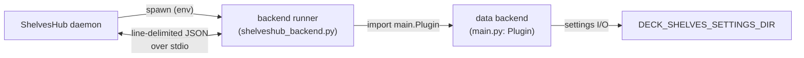

# Backend Contract — Data Backend Host

The ShelvesHub daemon can host a Deck Shelves **data backend** (settings
persistence, online wishlist/prices, launcher discovery, device state) as a child
process. This lets a sole host provide the same data RPCs the frontend bundle
expects — not just local shelves — with a **neutral** host environment: only the
Python standard library and the backend's own modules are available.

The runner is `runtime/backend/shelveshub_backend.py`.



## What the daemon hosts

A backend is a directory containing a `main.py` that exposes a `Plugin` class. The
daemon starts the runner, which imports the backend and serves its public methods
over stdio.

## Spawn environment

The runner is spawned with two variables:

| Variable | Meaning |
| --- | --- |
| `SHELVES_BACKEND_DIR` | Directory containing the backend (`main.py`). |
| `SHELVES_SETTINGS_DIR` | Where the backend keeps its settings (created beforehand); exported to the backend as `DECK_SHELVES_SETTINGS_DIR`. |

## Host environment offered to the backend

- **`DECK_SHELVES_SETTINGS_DIR`** — the settings directory. The backend's storage
  layer must honour this environment variable first.
- **stderr** — a free-form log sink; the runner forwards it line by line into the
  daemon log. `stdout` is reserved for the protocol (the runner duplicates the
  original fd 1 for protocol writes, then redirects `stdout` to stderr so stray
  `print()`s cannot corrupt the channel).
- **class contract** — `main.Plugin` with public async or sync methods, plus
  optional `_main()` / `_unload()` lifecycle hooks called at start and shutdown.
  Methods whose names begin with `_` are never callable remotely.

The backend must run on the standard library plus its own modules — no
host-specific imports are required or provided.

## Wire protocol

One JSON object per line, both directions, on stdio.

Request:

```json
{ "id": 1, "method": "get_settings", "args": null }
```

Response (success or error):

```json
{ "id": 1, "ok": true,  "result": { } }
{ "id": 1, "ok": false, "error": "message" }
```

Argument dispatch: an **object** is applied as keyword arguments, an **array** as
positional arguments, and `null` as no arguments.

## Default settings directory

When `SHELVES_SETTINGS_DIR` is not provided, the runner falls back to a per-OS
location:

| OS | Directory |
| --- | --- |
| Windows | `%APPDATA%\deck-shelves` |
| macOS | `~/Library/Application Support/deck-shelves` |
| Linux / SteamOS | `$XDG_DATA_HOME/deck-shelves` (or `~/.local/share/deck-shelves`) |
