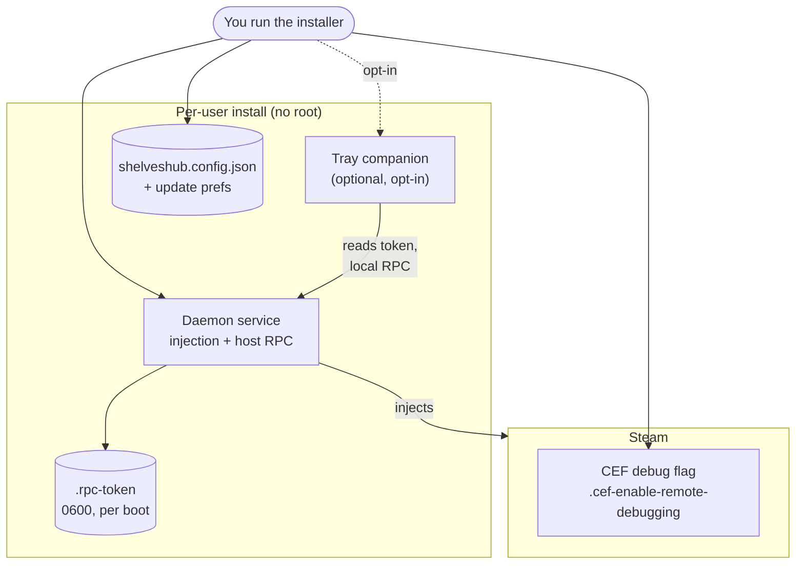
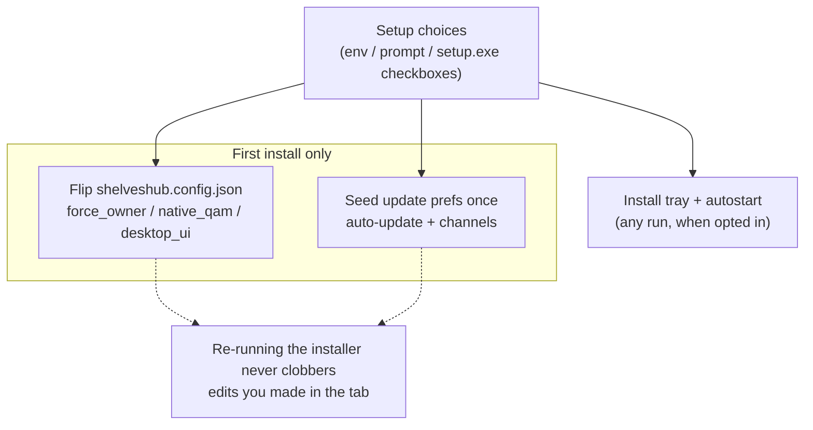

# Installation — process, options, and defaults

*[Leia em português](pt-BR/installation.md)*

One installer per OS puts ShelvesHub in place **per-user, without root** (the only
root use is migrating an older system install). Every installer offers the **same
setup choices** — as environment variables, an interactive prompt, or checkboxes in
the Windows `setup.exe` — and leaves every choice editable later in the ShelvesHub
tab. This page shows what each install lays down, the options and their defaults,
and where the optional tray companion fits.

## What an install puts in place

The daemon is registered to start automatically and run in the background. The
tray is installed **only if you opt in** (off by default). The installer also
creates Steam's CEF debug flag — Steam must be restarted once after a first
install so it opens the debug port the daemon connects to.

## How the options are applied

Config and update-preference choices are applied **only on a first install**, so an
upgrade never overwrites what you changed in the tab. The tray choice is an action
(install the binary + register autostart) and is honored on any run when opted in.

## Options and defaults

Every option is the same across OSes; the default is what you get by pressing
Enter / leaving a checkbox as-is.

| Option | Env var | Default | What it does |
|---|---|---|---|
| Cooperative ownership | `SHELVES_FORCE_OWNER` | off | Host Deck Shelves even if a plugin loader is present |
| Own Quick Access tab | `SHELVES_NATIVE_QAM` | on | Add ShelvesHub's native QAM tab |
| Desktop-client inject | `SHELVES_DESKTOP_UI` | off | Also inject into the plain desktop client (experimental) |
| Automatic updates | `SHELVES_AUTO_UPDATE` | on | Master switch for the two below |
| Update ShelvesHub | `SHELVES_AUTO_UPDATE_HUB` | on | Keep the daemon up to date |
| Update Deck Shelves | `SHELVES_AUTO_UPDATE_PLUGIN` | on | Keep the bundle up to date |
| ShelvesHub pre-releases | `SHELVES_HUB_PRERELEASE` | off | Include pre-release daemon builds |
| Deck Shelves pre-releases | `SHELVES_PLUGIN_PRERELEASE` | off | Include pre-release bundles |
| **Tray companion** | `SHELVES_TRAY` | **off** | Install the system-tray / menu-bar icon |

## Where autostart is registered, per OS

| OS | Install path | Daemon autostart | Tray autostart (opt-in) |
|---|---|---|---|
| SteamOS / Linux | `~/.local/share/shelveshub` | `systemctl --user` service | XDG autostart entry (Desktop Mode) |
| macOS | `~/.local/share/shelveshub` | launchd LaunchAgent `com.shelveshub` | LaunchAgent `com.shelveshub.tray` |
| Windows | `%LOCALAPPDATA%\ShelvesHub` | logon task `ShelvesHub` | logon task `ShelvesHubTray` |

## The tray companion

The tray is a **separate, optional** binary (`shelveshub-tray`). It holds no state
of its own: it shows whether ShelvesHub is hosting and offers quick actions
(pause/resume, restart the service, restart the data backend), each a call to the
daemon's **local RPC**. It authenticates with the per-boot token the daemon writes
to a `0600` file next to the install, so no new network surface is opened — the RPC
stays token-gated, loopback-only. If a package does not ship the tray binary, the
opt-in degrades to a clear note and installs nothing.

## Uninstalling

The uninstaller stops and removes the daemon service and the install directory,
and — if the tray was installed — stops it and removes its autostart entry. Your
Deck Shelves settings (shared with other hosts) and Steam's CEF debug flag are
**kept** unless you pass the purge option (`--purge` on the shell/macOS
uninstallers; the Windows uninstaller prompts).
