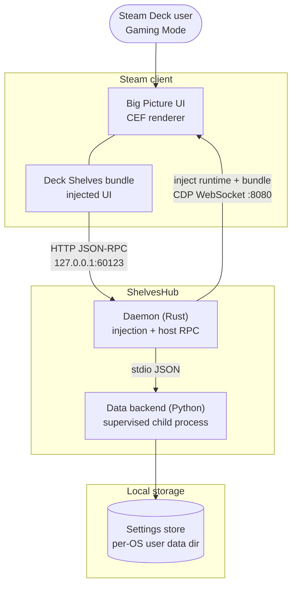
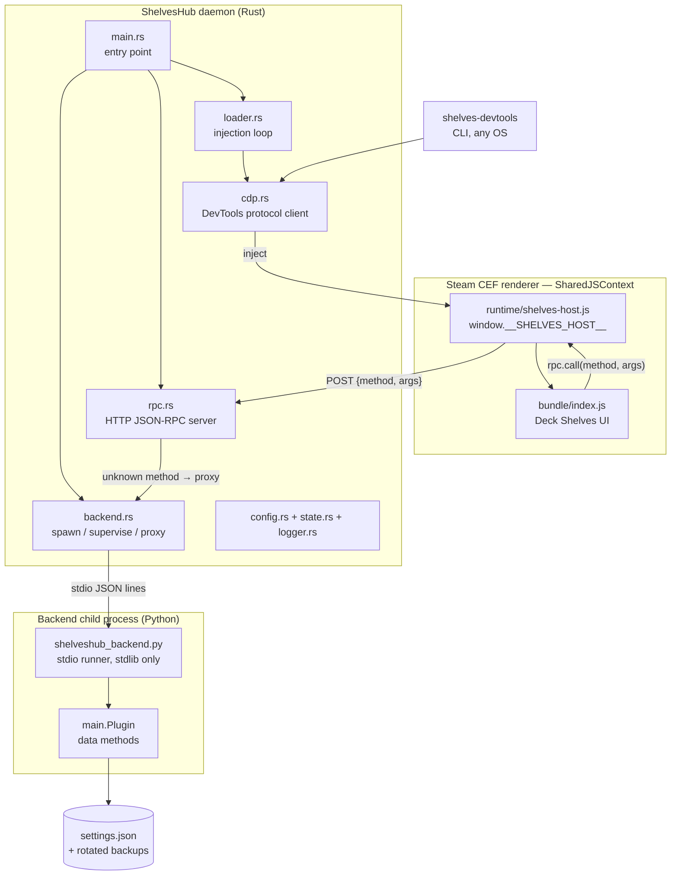
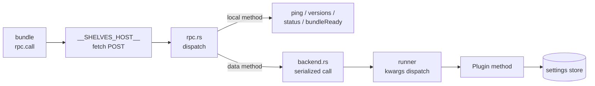

# ShelvesHub — Arquitetura

*[Read in English](../architecture.md)*

ShelvesHub é um pequeno serviço multiplataforma que injeta o pacote do Deck Shelves
na interface Big Picture do Steam. Ele fornece as APIs de runtime do host que o
pacote chama, e gerencia o ciclo de vida da injeção no Linux/SteamOS, no
macOS e no Windows.

---

## Visão geral do sistema

### O serviço em seu ambiente

### Peças do runtime

### Caminho de uma requisição de dados

O pacote recebe o objeto `HostApi` como `window.__SHELVES_HOST__` na
inicialização. Ele usa esse objeto para registrar hooks de montagem/desmontagem, invocar
métodos do host, e gerenciar rotas. Os componentes de interface e toda a lógica de renderização vivem inteiramente
dentro do pacote. Os métodos de dados fluem por um único pipeline serializado — uma única
chamada ao backend em andamento por vez — então as gravações nunca competem dentro deste host.

---

## Componentes

### Loader (`src/loader/`)

A cada ciclo (30s por padrão) ele se conecta ao renderizador CEF do Steam via o Chrome
DevTools Protocol, verifica se o pacote já está rodando
(`window.__SHELVES_LOADER__`), e — se não estiver — injeta o runtime do host
(`runtime/shelves-host.js`, que se torna `window.__SHELVES_HOST__`) seguido de
`bundle/index.js` via `Runtime.evaluate`. A conexão é reconstruída a cada ciclo,
então um reinício do Steam é reinjetado automaticamente. Os caminhos e o endpoint CEF são
configuráveis (`src/config.rs`).

Antes de injetar, o loop respeita a reivindicação de proprietário único do renderizador
(`window.__DECK_SHELVES_OWNER__`): se outro adaptador de host já possui o
renderizador, o ciclo nunca assume a hospedagem nem carrega o pacote do plugin. Com a
aba nativa de Acesso Rápido habilitada (`SHELVES_NATIVE_QAM=1`), ele ainda injeta apenas
seu runtime, que detecta o outro host e adiciona a aba do ShelvesHub ao lado
sem instalar seu próprio host — então ambas as abas coexistem e o plugin do
outro host permanece intocado; caso contrário, o ciclo recua completamente. Definir
`SHELVES_FORCE_OWNER=shelveshub` faz o ShelvesHub reivindicar um renderizador *sem dono*
imediatamente (pula a espera de acomodação do proprietário e grava `window.__SHELVES_FORCE_OWNER__`
para que o plugin selecione o ShelvesHub). Isso **não** sobrescreve um host que já
reivindicou o renderizador: uma reivindicação alheia sempre leva o daemon a recuar para o
caminho de coexistência (apenas a aba), porque dois hosts fazendo uma injeção completa em
um mesmo renderizador é instável. Portanto, a posse forçada é uma preferência de host único,
não uma tomada de um host ativo.

Enquanto o renderizador ainda estiver sem dono, `SHELVES_OWNER_SETTLE_SECS` (chave de configuração
`owner_settle_secs`) faz o loop esperar esse número de segundos por uma reivindicação antes
de hospedar o renderizador ele mesmo — então, em uma máquina compartilhada, um ciclo de injeção rápido
nunca começa a hospedar antes de outro host que ainda está iniciando. O padrão no código
é `0`; o `shelveshub.config.json` distribuído define **25** para a configuração primária
(de coexistência). Um host único o define de volta para `0` para inicializar imediatamente.

### Cliente CDP (`src/cdp/`)

Um cliente do Chrome DevTools Protocol feito do zero sobre um WebSocket bloqueante
(`tungstenite`). Descobre alvos via `GET /json`, escolhe o renderizador do Steam,
e expõe `evaluate` / `call` / descoberta de alvos. Compartilhado pelo loop do loader
e pela CLI `shelves-devtools`. Veja [debugging.md](./debugging.md).

### Servidor RPC (`src/rpc.rs`)

Servidor HTTP/1.1 bloqueante e minimalista em `127.0.0.1:60123` (configurável). O pacote
o alcança com um `fetch` POST de `{ method, args }` de dentro do renderizador, então
ele emite cabeçalhos CORS e trata preflight. Métodos registrados:

| Método | Resultado |
|---|---|
| `ping` | `"pong"` |
| `getVersion` | Versão semântica do loader a partir de `Cargo.toml` |
| `isInjected` | estado de injeção ao vivo a partir de `state.rs` |
| `getBackendStatus` | `{ configured, running }` para o backend de dados hospedado |

Todo outro método é tratado como método de dados: quando a hospedagem do backend está
configurada, ele é repassado ao backend hospedado (abaixo); caso contrário, retorna
um erro de `unknown method`. Cada conexão é servida em sua própria thread, então uma
chamada de dados lenta nunca atrasa as verificações.

### Host do backend (`src/backend.rs` + `runtime/backend/`)

Opcionalmente hospeda o backend de dados em Python do Deck Shelves como um processo filho
supervisionado (`SHELVES_BACKEND_DIR`; se não definido, desabilitado). O daemon inicia
`runtime/backend/shelveshub_backend.py` (apenas biblioteca padrão), que carrega
a classe `Plugin` do backend e serve seus métodos públicos via
JSON delimitado por linha no stdio — um argumento em formato de objeto é aplicado como
argumentos nomeados, um array como argumentos posicionais, nomes começando com `_` são rejeitados em
ambos os lados. O stderr do processo filho flui para o log do daemon; uma falha
é reiniciada após um período de espera, e uma chamada travada é encerrada e reiniciada. O
backend recebe seu diretório de configurações via `DECK_SHELVES_SETTINGS_DIR`
(diretório de dados de usuário padrão do sistema operacional, `SHELVES_SETTINGS_DIR` para sobrescrever) — um
local neutro, independente da árvore de arquivos de qualquer outra ferramenta. Um backend de
exemplo mínimo vive em `examples/backend/`.

### Logger (`src/logger.rs`)

Linhas de log estruturadas: `[LEVEL] [timestamp] [subsystem] message`. Níveis: INFO,
WARNING, ERROR, DEBUG. Usado por todos os módulos Rust.

### Runtime — HostApi

O runtime de host injetado é `runtime/shelves-host.js` — um script autocontido que
o loader avalia no renderizador. Ele instala `window.__SHELVES_HOST__` (o
`HostApi` concreto) e a aba nativa de Acesso Rápido, e delega o RPC ao
servidor Rust. O contrato que ele implementa é o pacote compartilhado `@deck-shelves/host`
(`HOST_API_VERSION = "1.2.0"`, apenas aditivo após a linha de base 1.0); seu código-fonte
tipado é incluído como o submódulo `host/` (`host/src/contract/`).

Veja [docs/host-api.md](./host-api.md) para a referência completa do contrato.

### Pacote (`bundle/index.js`)

Espaço reservado. Em produção, este é o pacote compilado do Deck Shelves — colocado aqui
pelo pipeline de lançamento do Deck Shelves. O loader o lê a partir de
`SHELVES_BUNDLE_PATH` (padrão: ao lado do binário); o conteúdo do pacote pertence
ao repositório do Deck Shelves. Um substituto funcional para testes locais vive em
`examples/bundle/shelves-example.js` (veja [debugging.md](./debugging.md)).

### Runtime do host (`runtime/shelves-host.js`)

A implementação executada do contrato HostApi. O loader o injeta no
renderizador antes do pacote, onde ele se torna `window.__SHELVES_HOST__`:
`lifecycle`, `rpc` (HTTP), `routes`, `notifications`, `platform`, e `qam`
(painéis do Menu de Acesso Rápido). Inclui um localizador de módulos webpack do
Steam feito do zero e um host de painel do QAM (trilho de ícones + painel deslizante, com uma
costura para uma aba nativa do QAM do Steam). Escrito do zero — nenhum código-fonte de
loader de terceiros é copiado. Distribuído junto do binário (`runtime/` ao lado de
`shelveshub`).

### Ferramenta de desenvolvimento (`src/bin/devtools.rs`)

`shelves-devtools` — uma CLI CDP multiplataforma (`targets` / `probe` / `eval` /
`inject` / `reload` / `console`) para inspecionar e depurar o renderizador no
Linux, macOS ou Windows, localmente ou contra um Deck via um túnel SSH.

---

## Gerenciamento de serviço multiplataforma

| Plataforma | Mecanismo | Arquivo de unidade |
|---|---|---|
| Linux / SteamOS | systemd | `installer/Linux/shelveshub.service` |
| macOS | launchd | `installer/macOS/com.shelveshub.plist` |
| Windows | Task Scheduler | `installer/Windows/install.ps1` |

As três iniciam o binário compilado `shelveshub`, reiniciam em caso de falha, e rodam
como o usuário atual, para que compartilhem a sessão do Steam.

---

## Trabalho pendente (modo ShelvesHub)

Toda a superfície original da API do host está implementada em
`runtime/shelves-host.js`; esta lista de verificação está completa.

- [x] Substituir o placeholder de `is_injected()` por uma verificação CEF real
- [x] Substituir a injeção via chamada de shell pelo mecanismo de injeção
      via WebSocket/CDP no renderizador do Steam
- [x] Implementar `ShelvesHostApi.lifecycle.*` (`register` / `onMount` / `onUnmount`)
- [x] Implementar `ShelvesHostApi.routes.*` (registro de rotas do lado do Steam via o
      `routerHook` concreto — `addRoute` / `removeRoute` / `addPatch`)
- [x] Implementar `ShelvesHostApi.notifications.*` (`toast` / `send` via
      `SteamClient.Notifications`)
- [x] Implementar `ShelvesHostApi.platform.navigateToApp` (`SteamClient.Apps.RunGame`)
