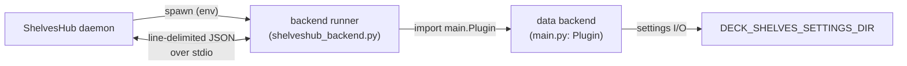

# Backend Contract — Host do Backend de Dados

*[Read in English](../backend-contract.md)*

O daemon do ShelvesHub pode hospedar um **backend de dados** do Deck Shelves (persistência
de configurações, lista de desejos/preços on-line, descoberta de launchers, estado do dispositivo) como um processo
filho. Isso permite que um host único forneça as mesmas RPCs de dados que o pacote do
frontend espera — não apenas as prateleiras locais — com um ambiente de host **neutro**: apenas
a biblioteca padrão do Python e os próprios módulos do backend ficam disponíveis.

O executor é `runtime/backend/shelveshub_backend.py`.



## O que o daemon hospeda

Um backend é um diretório contendo um `main.py` que expõe uma classe `Plugin`. O
daemon inicia o executor, que importa o backend e serve seus métodos públicos
via stdio.

## Ambiente de execução

O executor é iniciado com duas variáveis:

| Variável | Significado |
| --- | --- |
| `SHELVES_BACKEND_DIR` | Diretório contendo o backend (`main.py`). |
| `SHELVES_SETTINGS_DIR` | Onde o backend mantém suas configurações (criado previamente); exportado ao backend como `DECK_SHELVES_SETTINGS_DIR`. |

## Ambiente de host oferecido ao backend

- **`DECK_SHELVES_SETTINGS_DIR`** — o diretório de configurações. A camada de armazenamento do
  backend deve respeitar essa variável de ambiente primeiro.
- **stderr** — um canal de log de formato livre; o executor encaminha linha por linha para o
  log do daemon. O `stdout` é reservado para o protocolo (o executor duplica o
  fd 1 original para as gravações do protocolo, então redireciona o `stdout` para o stderr, para que
  `print()`s perdidos não corrompam o canal).
- **contrato de classe** — `main.Plugin` com métodos públicos assíncronos ou síncronos, além de
  hooks de ciclo de vida opcionais `_main()` / `_unload()` chamados na inicialização e no encerramento.
  Métodos cujo nome começa com `_` nunca são chamáveis remotamente.

O backend deve rodar apenas com a biblioteca padrão mais seus próprios módulos — nenhuma
importação específica de host é exigida ou fornecida.

## Protocolo de comunicação

Um objeto JSON por linha, em ambas as direções, via stdio.

Requisição:

```json
{ "id": 1, "method": "get_settings", "args": null }
```

Resposta (sucesso ou erro):

```json
{ "id": 1, "ok": true,  "result": { } }
{ "id": 1, "ok": false, "error": "message" }
```

Despacho de argumentos: um **objeto** é aplicado como argumentos nomeados, um **array** como
argumentos posicionais, e `null` como nenhum argumento.

## Diretório de configurações padrão

Quando `SHELVES_SETTINGS_DIR` não é fornecido, o executor recorre a um local
padrão por sistema operacional:

| SO | Diretório |
| --- | --- |
| Windows | `%APPDATA%\deck-shelves` |
| macOS | `~/Library/Application Support/deck-shelves` |
| Linux / SteamOS | `$XDG_DATA_HOME/deck-shelves` (ou `~/.local/share/deck-shelves`) |
