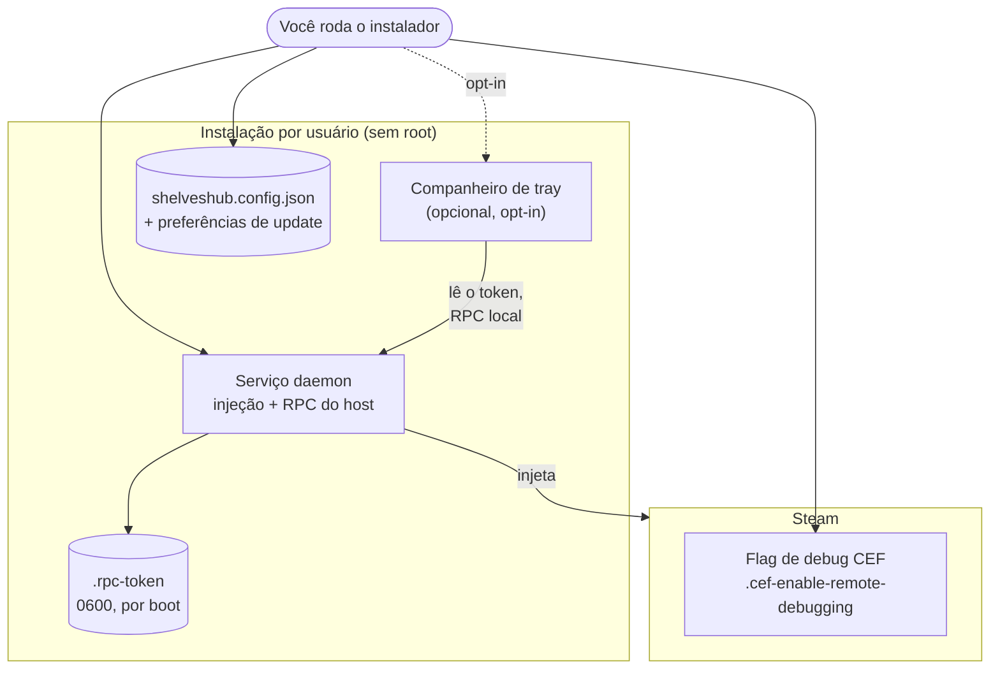
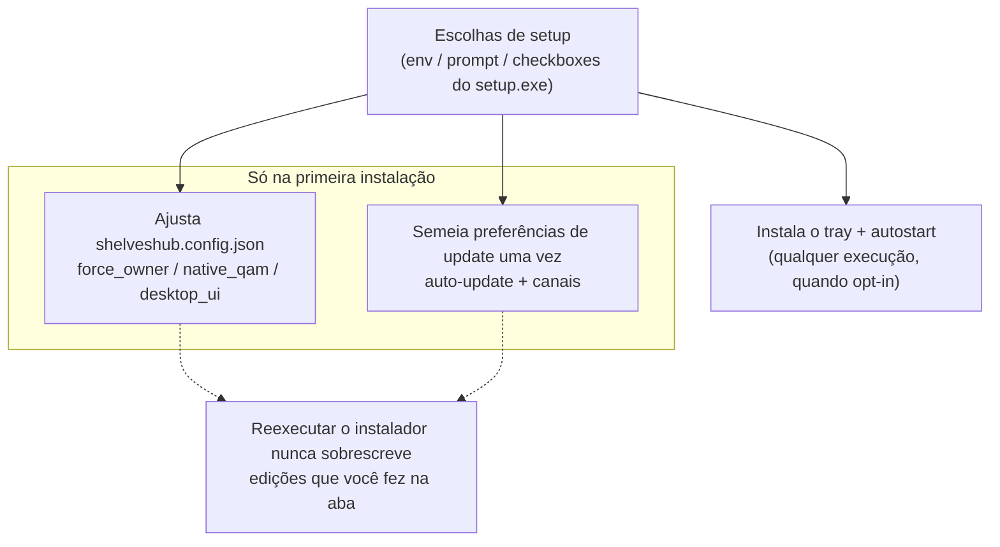

# Instalação — processo, opções e defaults

*[Read in English](../installation.md)*

Um instalador por SO coloca o ShelvesHub no lugar **por usuário, sem root** (o único
uso de root é migrar uma instalação antiga de sistema). Todos os instaladores
oferecem as **mesmas escolhas de configuração** — como variáveis de ambiente, um
prompt interativo, ou checkboxes no `setup.exe` do Windows — e deixam cada escolha
editável depois na aba do ShelvesHub. Esta página mostra o que cada instalação
coloca, as opções e seus defaults, e onde entra o companheiro de tray opcional.

## O que uma instalação coloca

O daemon é registrado para iniciar automaticamente e rodar em segundo plano. O tray
é instalado **só se você optar** (desligado por padrão). O instalador também cria a
flag de debug CEF do Steam — o Steam precisa ser reiniciado uma vez após a primeira
instalação para abrir a porta de debug à qual o daemon se conecta.

## Como as opções são aplicadas

As escolhas de config e de preferências de update são aplicadas **só na primeira
instalação**, então um upgrade nunca sobrescreve o que você mudou na aba. A escolha
do tray é uma ação (instalar o binário + registrar o autostart) e é respeitada em
qualquer execução quando você opta por ela.

## Opções e defaults

Toda opção é a mesma entre os SOs; o default é o que você obtém apertando Enter /
deixando um checkbox como está.

| Opção | Variável de ambiente | Default | O que faz |
|---|---|---|---|
| Posse cooperativa | `SHELVES_FORCE_OWNER` | off | Hospedar o Deck Shelves mesmo com um loader de plugins presente |
| Aba própria de Quick Access | `SHELVES_NATIVE_QAM` | on | Adicionar a aba QAM nativa do ShelvesHub |
| Injeção no cliente desktop | `SHELVES_DESKTOP_UI` | off | Injetar também no cliente desktop puro (experimental) |
| Atualizações automáticas | `SHELVES_AUTO_UPDATE` | on | Chave mestra das duas abaixo |
| Atualizar o ShelvesHub | `SHELVES_AUTO_UPDATE_HUB` | on | Manter o daemon atualizado |
| Atualizar o Deck Shelves | `SHELVES_AUTO_UPDATE_PLUGIN` | on | Manter o bundle atualizado |
| Pré-lançamentos do ShelvesHub | `SHELVES_HUB_PRERELEASE` | off | Incluir builds pré-lançamento do daemon |
| Pré-lançamentos do Deck Shelves | `SHELVES_PLUGIN_PRERELEASE` | off | Incluir bundles pré-lançamento |
| **Companheiro de tray** | `SHELVES_TRAY` | **off** | Instalar o ícone de tray / barra de menu |

## Onde o autostart é registrado, por SO

| SO | Caminho de instalação | Autostart do daemon | Autostart do tray (opt-in) |
|---|---|---|---|
| SteamOS / Linux | `~/.local/share/shelveshub` | serviço `systemctl --user` | entrada de autostart XDG (Desktop Mode) |
| macOS | `~/.local/share/shelveshub` | LaunchAgent launchd `com.shelveshub` | LaunchAgent `com.shelveshub.tray` |
| Windows | `%LOCALAPPDATA%\ShelvesHub` | tarefa de logon `ShelvesHub` | tarefa de logon `ShelvesHubTray` |

## O companheiro de tray

O tray é um binário **separado e opcional** (`shelveshub-tray`). Ele não guarda
estado próprio: mostra se o ShelvesHub está hospedando e oferece ações rápidas
(pausar/retomar, reiniciar o serviço, reiniciar o backend de dados), cada uma uma
chamada ao **RPC local** do daemon. Ele se autentica com o token por-boot que o
daemon grava num arquivo `0600` ao lado da instalação, então nenhuma superfície de
rede nova é aberta — o RPC segue protegido por token, só em loopback. Se um pacote
não traz o binário do tray, o opt-in degrada para um aviso claro e não instala nada.

## Desinstalando

O desinstalador para e remove o serviço do daemon e o diretório de instalação e —
se o tray foi instalado — para ele e remove sua entrada de autostart. As suas
configurações do Deck Shelves (compartilhadas com outros hosts) e a flag de debug
CEF do Steam são **mantidas**, a menos que você passe a opção de purge (`--purge`
nos desinstaladores shell/macOS; o desinstalador do Windows pergunta).
