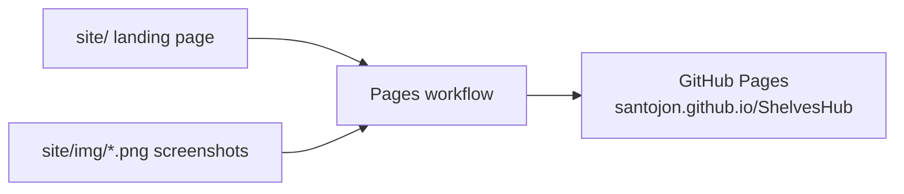
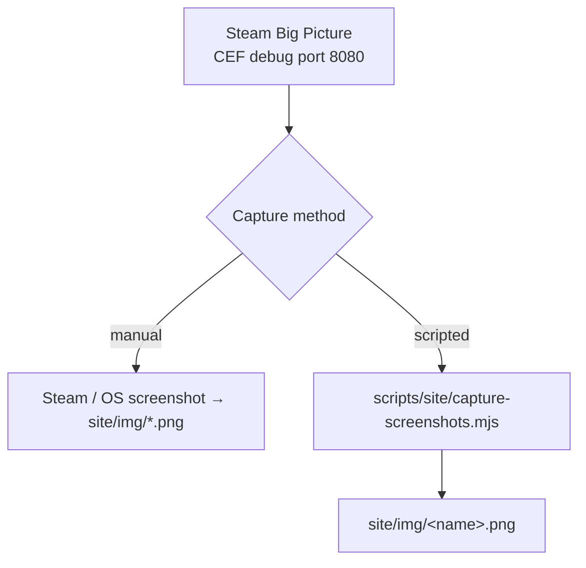

# Vitrine e capturas de tela

A landing page em [`site/`](../site/) mostra uma galeria de capturas de tela. Esta página
incorpora as capturas feitas e documenta como elas são produzidas e publicadas.

## Capturas de tela

| | |
| --- | --- |
|  |  |
| **Aba de Acesso Rápido** — o editor do Deck Shelves, aberto diretamente. | **Config** — configurações do host no painel. |
|  |  |
| **Solução de problemas** — ações de recuperação quando o pacote não consegue carregar. | **Logs** — o visualizador de logs embutido no painel. |

## Como o site publica

`.github/workflows/pages.yml` publica `site/` a cada push em `main` que o
altere (configuração única: repo Settings → Pages → Source: "GitHub Actions").
A galeria renderiza quaisquer PNGs existentes em `site/img/` — sem etapa de build.

## O conjunto de capturas de tela

Coloque PNGs com estes nomes em `site/img/`; a galeria os detecta
automaticamente (os que faltarem são simplesmente ignorados):

| Arquivo | Mostra |
|---|---|
| `home.png` | A Home do Deck Shelves, hospedada pelo ShelvesHub |
| `qam-tab.png` | A aba nativa de Acesso Rápido (o editor abre diretamente) |
| `fallback.png` | O painel de fallback — ações de recuperação + o visualizador de logs |
| `coexist.png` | As duas abas, coexistindo com outro host |

Use um enquadramento próximo de 16:10 para combinar com os cartões da galeria.

## Capturando

- **Manual (confiável, qualquer plataforma):** tire uma captura de tela do Steam ou do
  sistema operacional da tela desejada e salve-a em `site/img/` com o nome acima.
- **Roteirizada (CDP):** `node scripts/site/capture-screenshots.mjs <name>` captura
  a janela do Big Picture pela porta de depuração CEF, salvando em `site/img/<name>.png`. Abra
  a tela primeiro, e **pare o daemon** durante a captura (um segundo cliente CDP pode
  travar a porta). OBSERVAÇÃO: o suporte do `Page.captureScreenshot` na janela CEF do Big
  Picture do Steam **ainda não foi validado no dispositivo** — se der timeout, use o
  método manual. Validar isso (ou encontrar um caminho de captura via CDP que funcione) está sendo
  acompanhado internamente.

## Prévia de desenvolvimento

Abra `site/index.html` diretamente em um navegador para pré-visualizar a página localmente; é uma
página estática autocontida (sem necessidade de servidor ou etapa de build).
