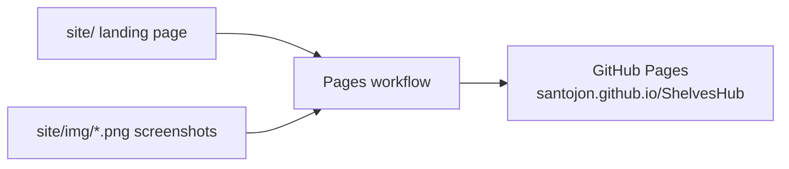
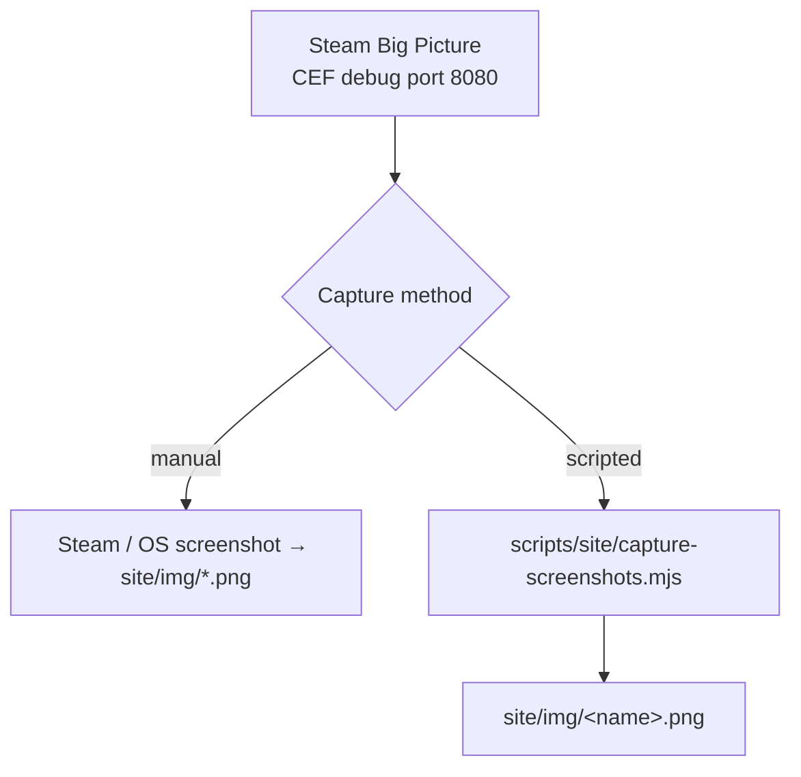

# Showcase & screenshots

The landing page at [`site/`](../site/) shows a screenshot gallery. This page
documents how those screenshots are produced and published.

## How the site publishes

`.github/workflows/pages.yml` publishes `site/` on every push to `main` that
touches it (one-time setup: repo Settings → Pages → Source: "GitHub Actions").
The gallery renders whatever PNGs exist under `site/img/` — no build step.

## The screenshot set

Drop PNGs with these names into `site/img/`; the gallery picks them up
automatically (missing ones are simply skipped):

| File | Shows |
|---|---|
| `home.png` | The Deck Shelves Home, hosted by ShelvesHub |
| `qam-tab.png` | The native Quick Access tab (editor opens directly) |
| `fallback.png` | The fallback panel — recovery actions + the log viewer |
| `coexist.png` | Both tabs, coexisting with another host |

Use a 16:10-ish framing to match the gallery cards.

## Capturing

- **Manual (reliable, any platform):** take a Steam or OS screenshot of the view
  and save it under `site/img/` with the name above.
- **Scripted (CDP):** `node scripts/site/capture-screenshots.mjs <name>` captures
  the Big Picture window over the CEF debug port into `site/img/<name>.png`. Open
  the view first, and **stop the daemon** while capturing (a second CDP client can
  wedge the port). NOTE: `Page.captureScreenshot` support on Steam's CEF Big
  Picture window is **not yet validated on-device** — if it times out, use the
  manual method. Validating (or finding the working CDP capture path) is tracked
  internally.

## Development preview

Open `site/index.html` directly in a browser to preview the page locally; it is a
self-contained static page (no server or build step needed).
